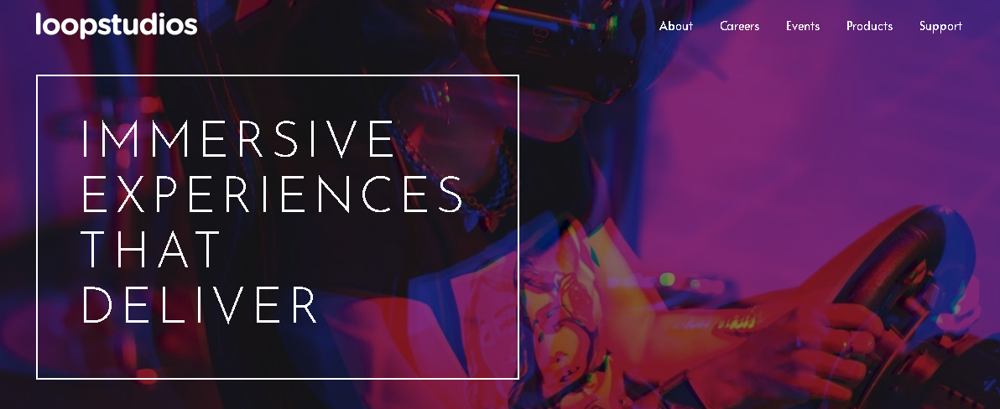
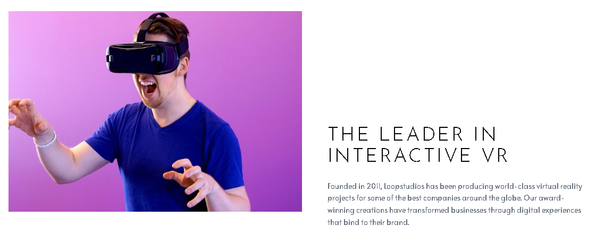
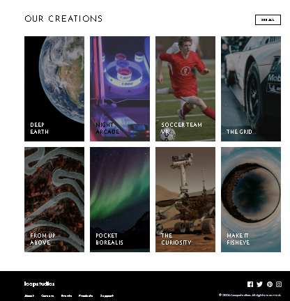

# 🏝️ Va, te dejo tu README ya listo, limpio y adaptado a tu proyecto de **Loopstudios**, siguiendo el estilo que quieres pero bien redactado para entrega:

---

# Proyecto: Loopstudios Landing Page

Este proyecto consiste en el desarrollo de la landing page de Loopstudios utilizando Astro y Tailwind CSS.
El objetivo es aplicar los conocimientos sobre componentes, maquetación, estilos responsivos y utilidades CSS para construir un diseño limpio, moderno y adaptable a diferentes dispositivos.

---

## Descripción general

### Vista previa del proyecto

La landing page presenta un diseño moderno enfocado en experiencias inmersivas, con secciones como header, hero, interactive, creations y footer.
El diseño es completamente responsivo y se adapta tanto a dispositivos móviles como de escritorio.





---

## Enlaces del proyecto

* Repositorio en GitHub: [https://github.com/Gustav-code/loopstudios](https://github.com/Gustav-code/loopstudios)
* Sitio desplegado: (opcional)

---

## Proceso de desarrollo

### Tecnologías utilizadas

* Astro
* Tailwind CSS
* HTML5 semántico
* Diseño responsivo
* Componentes reutilizables en Astro
* JavaScript para interacción del menú móvil

---

## Lo que aprendí

* Crear una estructura modular utilizando componentes en Astro.
* Implementar estilos de forma rápida y eficiente con Tailwind CSS.
* Resolver problemas de configuración entre Astro y Tailwind.
* Manejar diseño responsivo utilizando utilidades como flex, grid y breakpoints.
* Implementar interacciones básicas como el menú móvil con JavaScript.

Ejemplo de código utilizado:

```html
<div class="grid grid-cols-1 md:grid-cols-4 gap-6">
  <div class="relative group cursor-pointer overflow-hidden">
    
  </div>
</div>
```

---

## Áreas de mejora

* Mejorar la organización del código en componentes más reutilizables.
* Optimizar imágenes para mejorar el rendimiento.
* Mejorar el diseño en dispositivos móviles pequeños.

---

## Recursos útiles

* [https://chatgpt.com/](https://chatgpt.com/) para resolver errores y dudas técnicas


---

## Autor

Nombre completo: Gustavo Eduardo Castro Limón
Carrera: TICS
Grupo: 11:00 a 12:00
Correo institucional: [23151227@aguascalientes.tecnm.mx](mailto:23151227@aguascalientes.tecnm.mx)

---

## Reflexión final

Lo más difícil de este proyecto fue la configuración inicial de Tailwind CSS con Astro, ya que surgieron errores relacionados con PostCSS y la integración que impedían que los estilos funcionaran correctamente.

Aprendí a instalar y desisntalar correctamente Tailwind en Astro, a trabajar con componentes reutilizables y a implementar diseño responsivo de manera más eficiente.

